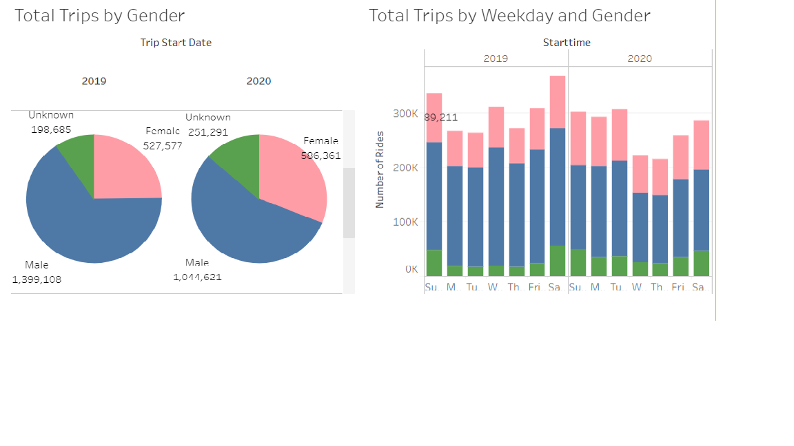

# Citi-Bike-Analytics-Tableau
 

Click here https://public.tableau.com/profile/anuradha.guha#!/vizhome/CitiBikes_15959784357250/Story1 to open the attached workbook.

The objective of this exercise is to create a dashboard for the New York Citi Bike Program.

The data is collected, organized, and made public on the Citi Bike Data webpage.

## Here are some findings:

Lesser people are biking in 2020. Trip duration has gone up. Peak hours are the same. Weekends were not that busy in 2020. 
More riders on Mon and Tues in 2020.  Number of female riders went up in 2020. 

![citi2](citi2.png
More females rode in 2020 as comapred to 2019. Male riders decreased. Subscriptions went down in 2020. 
There were a lot more middle aged customers in 2020
